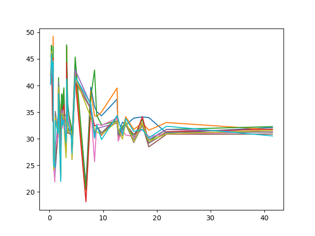
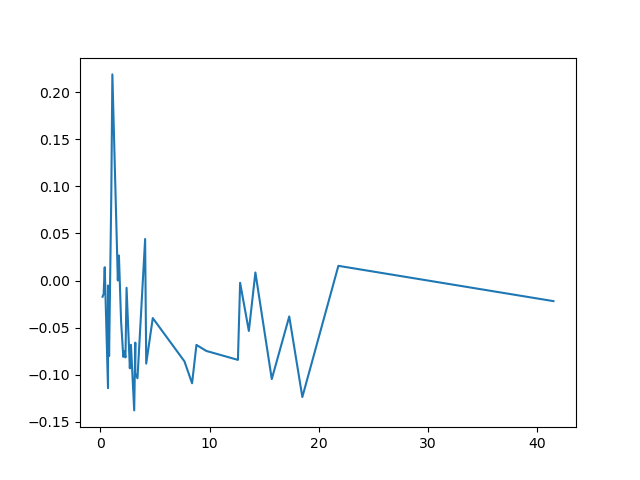
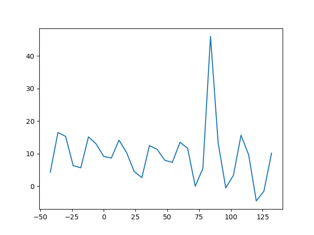
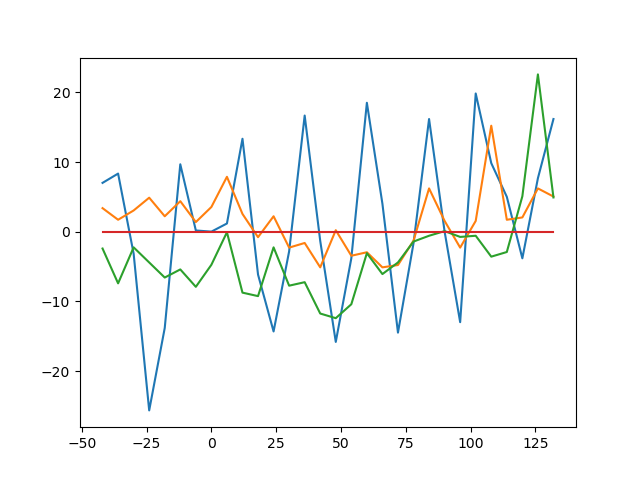
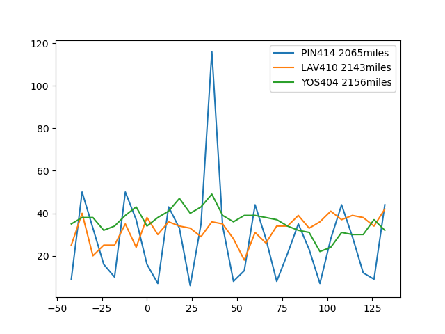

# 2020Fall_projects
# Team member & Contributes: 
   Xinze Fan, Dezhou Chen   
#Topic: 
   Ozone layer/ Ozone pollution or related gas analyze.
#Backgroud Information:

# Assumption 1:  
- Data Used:      
    - metdata_year.csv in ozone folder which contains the precipitation and ozone data for all the sites in united states.    
    - Site.csv : pair each SITE_ID to which State it actually in.     
    - water_cover.csv : each States' water coverage rate in United States.
- Dose the rain falls influence the ozone pollution?    
    (People always feel the air is more fresh and clean after raining. So is that means when it is raining, the water will have some chemical reaction with the ozone pollution. If this is true, it means after raining, the ozone pollution amount will smaller.)       

    We calculate the 5 hours average ozone pollution before each raining, and also the 5 hours average ozone pollution after each time of raining.
    Then we calculate the rate which the times that pollution is getting lower divided by the total times of raining.
    Below are the 10 example result by the SiteID in alphabetical order.
          
   SITE_ID  rate of getting better   
    ABT147  0.5108447488584474      
    ACA416  0.4541176470588235      
    ALC188  0.5356164383561643     
    ALH157  0.5323059360730593     
    ANA115  0.5202054794520548     
    ARE128  0.541324200913242     
    ASH135  0.5256849315068494      
    BAS601  0.40764331210191085     
    BBE401  0.3       
    BEL116  0.5787545787545788     
    BFT142  0.39509132420091325      
         
    As a overview for all United States in year 2010-2019:    
    we have the highest rate: 0.6363636363636364 and the lowest rate: 0.47619047619047616
    
    2010: 0.5357142857142857    
    2011: 0.47619047619047616   
    2012: 0.5934065934065934   
    2013: 0.5869565217391305     
    2014: 0.6     
    2015: 0.5876288659793815   
    2016: 0.53125     
    2017: 0.5833333333333334      
    2018: 0.5773195876288659   
    2019: 0.6363636363636364     
    
    Through the data above, we can see that only 1 year has less than 50% of the better SITE.     
   
    ---- Conclusion ----    
    The rain fall (PRECIPITATION) has significant influence on the ozone pollution. The recent 10 years data shows that around 60% of the site's pollution each year will be optimized by the rain.    
- How is the water coverage influence the ozone pollution?     
    (From the previous analyze, we found that water does influence the ozone pollution. So after analyzed the water from rain fall, we want to focus on the other side: the water in the lake or river.   
     We want to see if the water coverage of each state affect to the ozone pollution.)
     
    Below is plot shows the relationship between the state water coverage with the average ozone pollution.    
    The x-axis is the percentage of the state water coverage rate, the y-axis is the mean ozone pollution for that state. And each line represent a single year. So the plot show the recent 10 years, each state's water coverage with the mean ozone pollution.   
       
    From the plot, we can see that the coverage of the 0-10% has huge difference in each states so that the lines are tend to be more bounce.
    The coverage rate 10-20% is much more flat. And the lines going aggregation at the end. Of course since there are not too much states have the water coverage rate in 30-40%, it is not a significant value to give the conclusion that the line are going aggregation. However, we have a significant amount of states are in the 10-20% range. From this part
    we can prove that with the higher water coverage, the ozone pollutions are tend to be more flat curve and they aggregated to a certain range. 
    
    Further more, we also analyzed the ozone pollution growth rate. Consider about how CO2's circulation in the earth, water is an important part to do the chemical reaction and a buffer. So if our assumption is correct, as how CO2 circulation, the ozone pollution should have less changing rate in the area with more water coverage.   
        
    This plot shows the relationship between the water coverage and the growth rate of the ozone pollution in recent 10 years. (x-axis: the water coverage, y-axis: recent 10 years average ozone growth rate)       
    From the plot we can indicate that same as the previous analyze, the more water a state has, it has a more constant growth rate. 0-5% water coverage part have a really bouncy line which we believe that since there is too little water to reaction with ozone-pollution and has almost no buffer to the rapidly increasing ozone pollution. 
    And the area with 5% - 20% are tend to be converge in growth rate -10% - 0%. Such analyze proved that our previous assumption is correct.     
    ---- Conclusion ----    
    The water act as a buffer in the ozone circulation, so with the higher water coverage, the ozone pollution's mean are tend to be more converge. And if a state has a higher water coverage, its ozone pollution's growth rate is less likely to change either.
     
    
# Assumption 2:
Assumption2:     
- Data used:
    - metdata file for ozone pollution recent 10 years
    - data file for the recent volcanoes eruption information
    - metdata file for other pollution gas in recent 10 years
    
- Will the volcanoes eruption influence the ozone pollution?    
    (As most of the environment department discover, one of the factor influence the ozone layer is the volcanoes' eruption. So we want to analyze that when the volcano erupted, how does the ozone pollution change. )     
     - Difficulties:     
      Since the ozone data is not really high quality which means we missed some data, especially the Hawaii. The Hawaii's volcano was erupted 3 times in 2018, by there are no ozone data collected in Hawaii during that year. 
     So instead of trying to analyze its own State data, we collected nearest 5 sites to where the volcanoes are. 
     Then select all usable data to do the further analyze.     
     - Analyze:     
     After sort the 5 nearest sites, we plot the time period from 48h before the eruption to 132h after the eruption.      
     Notice that, since these site are all 2000 miles away from the volcano, so these measurements are likely to be affect by lots of reason. For example, the volcanoes did not explore that much pollutions or the pollutions did not travel that much.
     In this report, we will just show some significant results, and others full result plots are in the result_graph/volcano folder.
     - Results:    
     (All these plots is the relationships between the time and the ozone pollution amount. x-axis: 48 hours before erupted to 132 hours after erupted.
     y-axis: the ozone pollution amount. Labels: each site's Site_ID and how many miles its away from the volcano)
     
     This plot clearly shows that the site: DEN417 which is 3856 miles from the volcano 'Sarigan' has a huge ozone pollution growth after 75 hours of eruption.
     
     Above is the 'Kilauea' which erupted in 2012-03-02. As we can see that the LAV410 appeared same rapidly growth after 100 hours of the eruption.
     But others nearest site did not have a significant change during this time. So we believed that this is affected by the wind blow direction. Such means that after the volcano erupted, the wind blow the pollution to one specific direction so not all near by sites got influenced by the volcano.
     
     (Another significant example) 

How about other pollution gas changing? 
# Assumption 3:
How recently 5 years(from 2015-2019) ozone mean compare in each of the state in the perspective of each months(From Jan to December)?

# Assumption 4:
How ozone mean in recently 5 years(from 2015-2019) compare in 4 different regions which are Midwest, Northeast, South and west?
In details, conclude the variation in all states in 4 different regions.
any state did not follow the trends in any region for each year?
